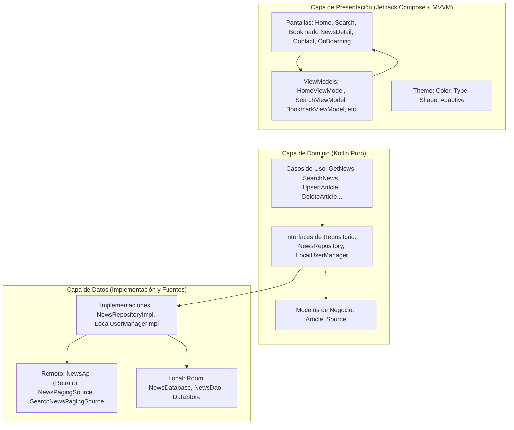

<div align="center">


# SuperNewsApp

**Tu ventana diaria a las noticias globales más relevantes con una experiencia editorial nativa de alta fidelidad.**

[](https://developer.android.com/)
[](https://kotlinlang.org/)
[](https://developer.android.com/jetpack/compose)
[](https://m3.material.io/)
[](docs/ARCHITECTURE.md)

<p align="center">
  <a href="#-visión-general">Visión General</a> •
  <a href="#-características-principales">Características</a> •
  <a href="#-stack-tecnológico">Stack Tecnológico</a> •
  <a href="#-arquitectura">Arquitectura</a> •
  <a href="#-instalación-y-configuración">Instalación</a> •
  <a href="#-documentación-técnica-detallada">Documentación</a> •
  <a href="PRIVACY_POLICY.md">Privacidad</a>
</p>

---

</div>

## 📰 Visión General

**SuperNewsApp** es una aplicación móvil nativa para Android concebida bajo estándares de ingeniería y diseño contemporáneos. Desarrollada íntegramente con **Jetpack Compose** y los principios de diseño de **Material 3**, ofrece una experiencia de lectura de actualidad fluida, intuitiva y visualmente cuidada.

La aplicación consume información en tiempo real desde la API global de noticias (NewsAPI), enriquecida con soporte opcional de traducción mediante DeepL, almacenamiento local reactivo para artículos favoritos y diseño adaptativo que escala con solvencia desde smartphones convencionales hasta tablets y dispositivos plegables.

---

## ✨ Características Principales

<table>
  <tr>
    <td width="50%">
      <h3>🎠 Carrusel Hero Destacado</h3>
      <p>Deslizador horizontal automático (<code>HorizontalPager</code>) con tarjetas inmersivas de alto impacto, gradiente de contraste vertical para lectura óptima, badge dinámico de fuente editorial, indicador de tiempo relativo y píldoras animadas con pausa interactiva al tocar.</p>
    </td>
    <td width="50%">
      <h3>🔴 Ticker de Última Hora en Vivo</h3>
      <p>Cinta de teletipo dinámica con distintivo pulsante <code>[ 🔴 ÚLTIMA HORA ]</code>. Ofrece transiciones verticales continuas entre titulares de última hora y navegación interactiva al pulsar sobre cualquier noticia en movimiento.</p>
    </td>
  </tr>
  <tr>
    <td width="50%">
      <h3>🗂️ Artículos con Carga Shimmer</h3>
      <p>Tarjetas estilizadas con esquinas redondeadas (<code>16.dp</code>), elevación sutil, miniaturas con efecto esquelético Shimmer durante la carga, badges con la fuente de origen y cálculo amigable de fecha relativa (<em>"Hace 15 min"</em>, <em>"Hace 2 h"</em>, <em>"Ayer"</em>).</p>
    </td>
    <td width="50%">
      <h3>📖 Detalle Editorial Completo</h3>
      <p>Pantalla de lectura inmersiva con fotografía panorámica, entradilla destacada en cursiva, estimación inteligente de tiempo de lectura (<em>"Lectura: 3 min"</em>) y enlace directo a la fuente web original.</p>
    </td>
  </tr>
  <tr>
    <td width="50%">
      <h3>🔍 Búsqueda Dinámica con Tendencias</h3>
      <p>Barra interactiva con botón de borrado inmediato y chips inteligentes con temas del momento (<em>Tecnología</em>, <em>Ciencia</em>, <em>Economía</em>, <em>Deportes</em>, <em>Salud</em>) para explorar con un solo toque.</p>
    </td>
    <td width="50%">
      <h3>💾 Guardados & Persistencia Local</h3>
      <p>Marcadores instantáneos respaldados localmente mediante Room Database. Contador de noticias guardadas en tiempo real y vista de estado vacío acogedora para incentivar la lectura.</p>
    </td>
  </tr>
  <tr>
    <td width="50%">
      <h3>🌓 Material You & Modo Oscuro OLED</h3>
      <p>Paleta cromática con contraste verificado AAA: azul editorial (<code>#1A56DB</code> / <code>#4B8BF5</code>), rojo de alerta para directos (<code>#EF4444</code>) y superficies oscuras limpias con negros profundos para optimizar batería en paneles OLED.</p>
    </td>
    <td width="50%">
      <h3>📐 Interfaz Adaptativa & Navigation 3</h3>
      <p>Navegación declarativa fuertemente tipada mediante Navigation 3 con soporte adaptativo para pantallas compactas, medianas y expandidas (<code>NavigationRail</code> y paneles complementarios).</p>
    </td>
  </tr>
</table>

---

## 🛠️ Stack Tecnológico

SuperNewsApp implementa las librerías y componentes más modernos del ecosistema Android:

```text
Ecosistema Moderno Android
├── UI & UX: Jetpack Compose (BOM 2026.08.00) + Material 3 + Tipografía Poppins
├── Navegación: Navigation 3 (1.1.7) con rutas inmutables fuertemente tipadas
├── Inyección de Dependencias: Dagger Hilt 2.60.1 + KSP 2.3.8
├── Networking: Retrofit 3.0.0 + Kotlinx Serialization 1.11.0 + NewsAPI & DeepL
├── Caché & Persistencia: Room 2.8.4 + Paging 3.5.1 + Jetpack DataStore Preferences 1.2.1
├── Imágenes: Coil 2.7.0 con memoria en dos niveles y caché en disco
└── Integridad: Google Play Integrity 1.6.0
```

| Capa / Módulo | Tecnología | Versión | Propósito |
| :--- | :--- | :--- | :--- |
| **Lenguaje** | Kotlin | `2.4.10` | Código conciso, nulo-seguro y moderno con Compose Compiler |
| **Framework UI** | Jetpack Compose | `BOM 2026.08.00` | Renderizado declarativo y reactivo sin XML |
| **Sistema de Diseño** | Material Design 3 | `1.12.0` | Tokens de color dinámicos, tipografía Poppins y componentes M3 |
| **Navegación** | Navigation 3 | `1.1.7` | Gráfico de navegación tipado con pila inmutable |
| **Inyección de Dependencias** | Hilt + KSP | `2.60.1` / `2.3.8` | Arquitectura desacoplada, pruebas simplificadas y generación limpia |
| **Red & Serialización** | Retrofit + Kotlinx Serialization | `3.0.0` / `1.11.0` | Cliente HTTP REST con parseo JSON de alto rendimiento |
| **Base de Datos Local** | Room Database | `2.8.4` | Persistencia SQLite local para artículos guardados |
| **Paginación Infinita** | Paging 3 | `3.5.1` | Flujos reactivos de noticias por demanda y consumo eficiente |
| **Preferencias** | DataStore Preferences | `1.2.1` | Almacenamiento asíncrono de preferencias (onboarding completado) |
| **Carga de Imágenes** | Coil | `2.7.0` | Carga asíncrona optimizada de fotografías periodísticas |
| **Integridad & Seguridad** | Play Integrity | `1.6.0` | Verificación de entorno y seguridad en distribución |

---

## 🏛️ Arquitectura

El proyecto sigue una estricta separación de responsabilidades basada en **Clean Architecture + MVVM**:



### 📁 Organización del Repositorio

```text
SuperNewsApp/
├── app/
│   ├── build.gradle.kts           # Configuración del módulo Android, dependencias y firmas
│   ├── proguard-rules.pro         # Reglas de optimización y ofuscación R8 / ProGuard
│   └── src/
│       ├── main/
│       │   ├── java/com/feryaeljustice/supernewsapp/
│       │   │   ├── annotations/   # Calificadores Hilt personalizados (@NewsApiKey, etc.)
│       │   │   ├── data/          # Clientes HTTP, DAOs Room, PagingSource y DataStore
│       │   │   ├── di/            # Módulos de Hilt (AppModule, ManagerModule, RepositoryModule)
│       │   │   ├── domain/        # Entidades puras, abstracciones de repositorios y UseCases
│       │   │   ├── presentation/  # UI Jetpack Compose, ViewModels y Navigation 3
│       │   │   │   ├── bookmark/  # Marcadores de noticias guardadas
│       │   │   │   ├── common/    # ArticleCard, BreakingNewsTicker, SearchBar, Shimmer
│       │   │   │   ├── contact/   # Pantalla de contacto y políticas editoriales
│       │   │   │   ├── home/      # Portada principal y FeaturedNewsCarousel
│       │   │   │   ├── navigation/# Contratos de rutas y barra de navegación adaptativa
│       │   │   │   ├── newsDetail/# Detalle de lectura enriquecida
│       │   │   │   └── search/    # Búsqueda con sugerencias de temas
│       │   │   └── ui/theme/      # Colores editoriales, tipografía Poppins y temas M3
│       │   └── res/               # Vectores, fuentes Poppins, strings multilingües
│       └── test/                  # Pruebas unitarias automatizadas
├── docs/                          # Documentación técnica exhaustiva
│   ├── ARCHITECTURE.md            # Arquitectura detallada, capas y flujo reactivo
│   ├── DESIGN_SYSTEM.md           # Tokens de diseño, tipografía y componentes
│   ├── FEATURES_GUIDE.md          # Especificación funcional de pantallas
│   └── assets/                    # Recursos visuales e isotipos para documentación
├── gradle/libs.versions.toml      # Catálogo centralizado de versiones de Gradle
├── build.gradle.kts               # Configuración global del proyecto
└── README.md                      # Presentación principal del repositorio
```

---

## 🚀 Instalación y Configuración

### 📋 Requisitos Previos

- **Android Studio**: Koala Feature Drop (2024.1.2) o superior (Ladybug / Meerkat recomendado).
- **Gradle**: 9.7.1 (gestionado de forma transparente mediante el wrapper `gradlew`).
- **JDK**: Java Development Kit 21 configurado en el entorno de desarrollo (`sourceCompatibility` y `targetCompatibility` 21).
- **Android SDK**: Compilado con SDK 37 (mínimo soportado Android 15 / API 35).

### ⚙️ Paso a Paso

1. **Clonar el repositorio**:
   ```bash
   git clone https://github.com/FeryaelJustice/SuperNewsApp.git
   cd SuperNewsApp
   ```

2. **Abrir en Android Studio**:
   Inicia Android Studio y selecciona **Open** apuntando al directorio raíz del proyecto.

3. **Configurar las credenciales de API**:
   Crea o edita el archivo `local.properties` en la raíz del proyecto agregando tus claves personales:
   ```properties
   sdk.dir=/ruta/a/tu/Android/sdk
   api_key=TU_API_KEY_DE_NEWSAPI
   deepl_api_key=TU_API_KEY_DE_DEEPL
   ```
   > 💡 *Nota: Puedes obtener una clave gratuita de NewsAPI en [newsapi.org](https://newsapi.org/) y de DeepL en [deepl.com](https://www.deepl.com/pro-api).*

4. **Sincronizar y compilar**:
   Pulsa en **Sync Project with Gradle Files** (`Sync Now`) en la barra superior del IDE.

---

## 📲 Compilación y Ejecución

### Desde Android Studio
Selecciona la configuración de ejecución `app`, elige un emulador o dispositivo físico y pulsa **Run** (`Shift + F10`).

### Desde la Terminal

- **Compilar APK de depuración (Debug)**:
  ```powershell
  # En Windows (PowerShell)
  .\gradlew.bat assembleDebug

  # En Linux / macOS
  ./gradlew assembleDebug
  ```

- **Ejecutar pruebas unitarias**:
  ```powershell
  # En Windows (PowerShell)
  .\gradlew.bat testDebugUnitTest

  # En Linux / macOS
  ./gradlew testDebugUnitTest
  ```

- **Generar paquete de distribución (Release Bundle)**:
  ```powershell
  .\gradlew.bat bundleRelease
  ```

---

## 📚 Documentación Técnica Detallada

Para profundizar en el diseño y la ingeniería de SuperNewsApp, consulta las guías especializadas en la carpeta `docs/`:

- 🎨 **[docs/DESIGN_SYSTEM.md](docs/DESIGN_SYSTEM.md)**: Sistema de diseño, tokens de color (Light/Dark), tipografía Poppins, escala de espaciado y directrices de accesibilidad.
- 🏗️ **[docs/ARCHITECTURE.md](docs/ARCHITECTURE.md)**: Análisis en profundidad de la Clean Architecture, flujo unidireccional de datos (UDF), Hilt y contratos de dominio.
- 📱 **[docs/FEATURES_GUIDE.md](docs/FEATURES_GUIDE.md)**: Desglose exhaustivo pantalla por pantalla, manejo de estados y flujos de usuario.
- 🛡️ **[PRIVACY_POLICY.md](PRIVACY_POLICY.md)**: Política de Privacidad oficial para Google Play Store y agregación de noticias.

---

<div align="center">

Hecho con dedicación usando **Kotlin** y **Jetpack Compose** • Distribuido con licencia libre para fines formativos y de desarrollo.

</div>

